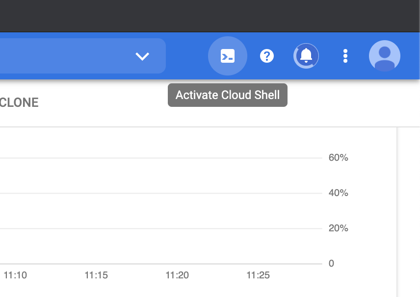
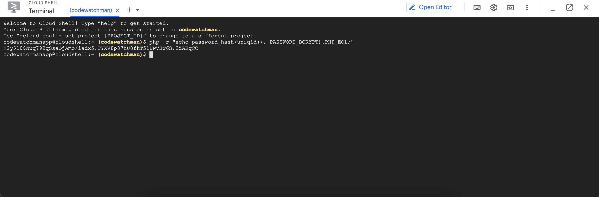
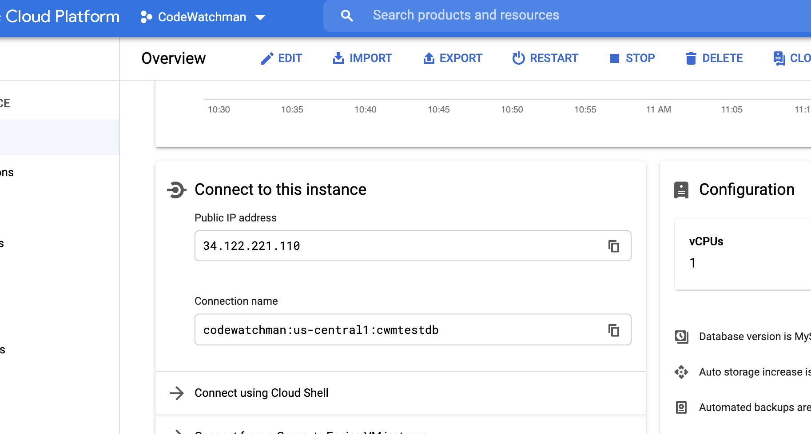
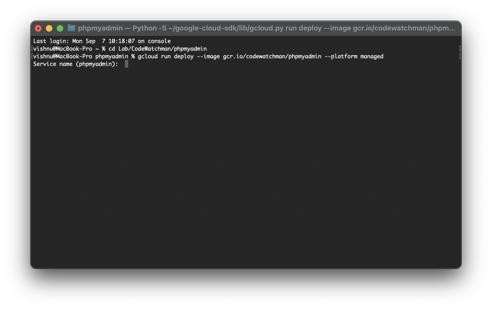
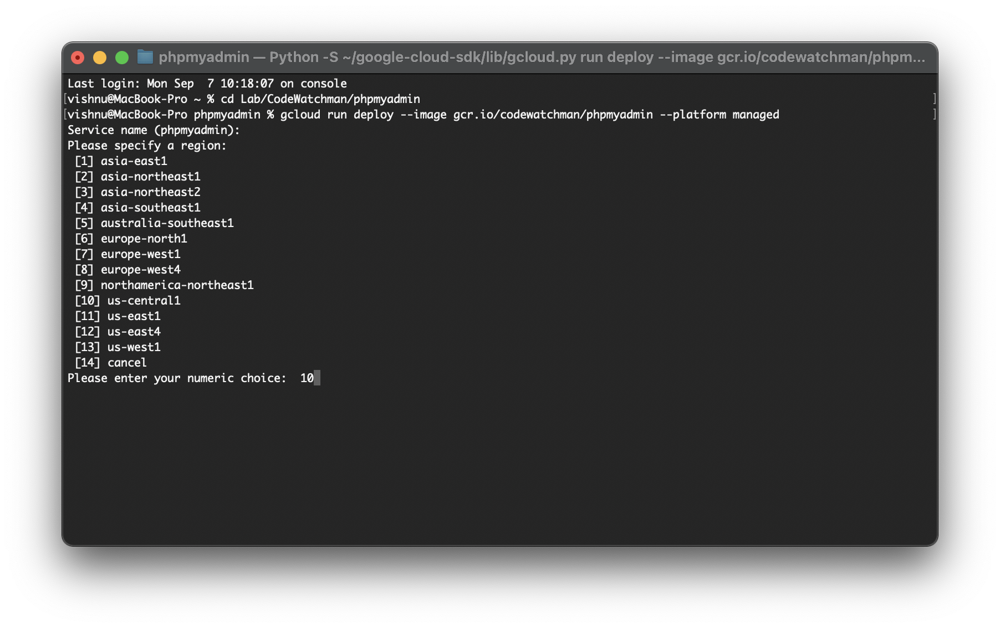
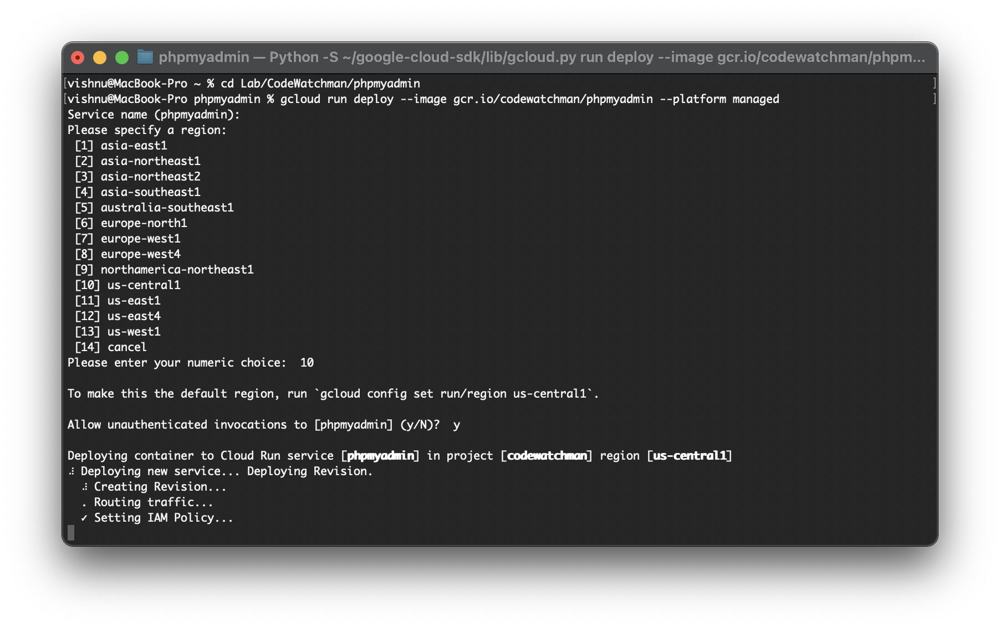
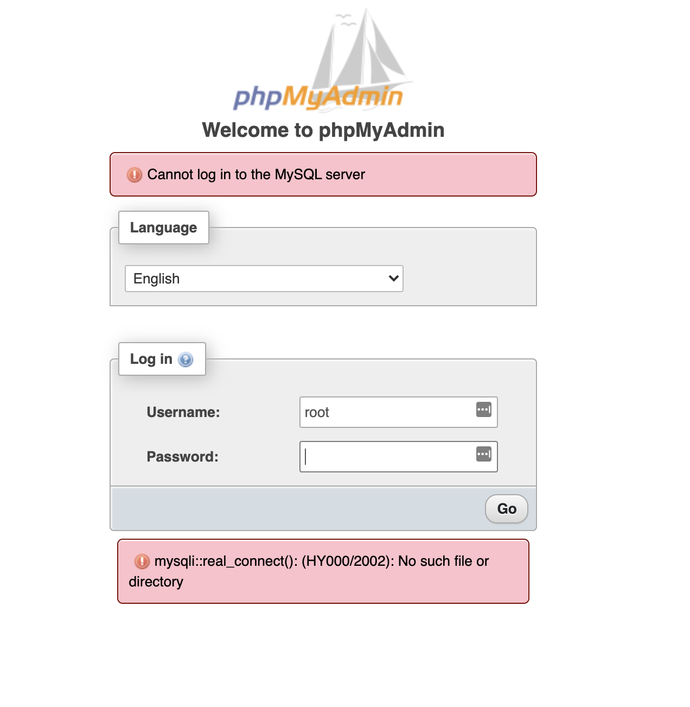
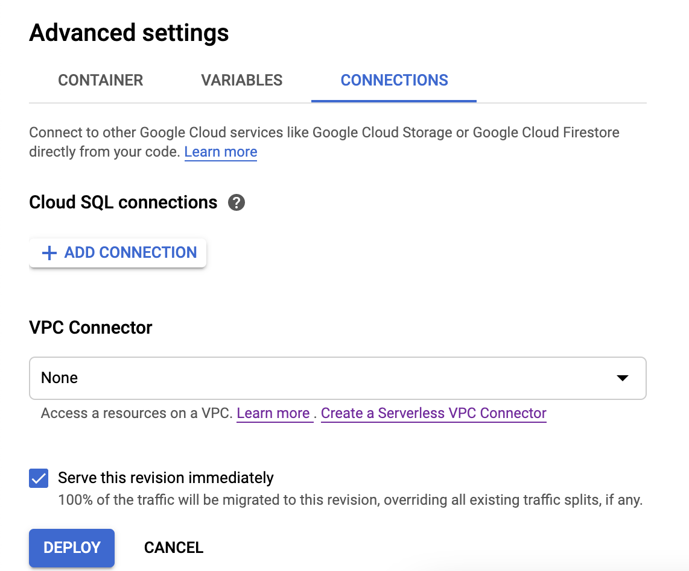
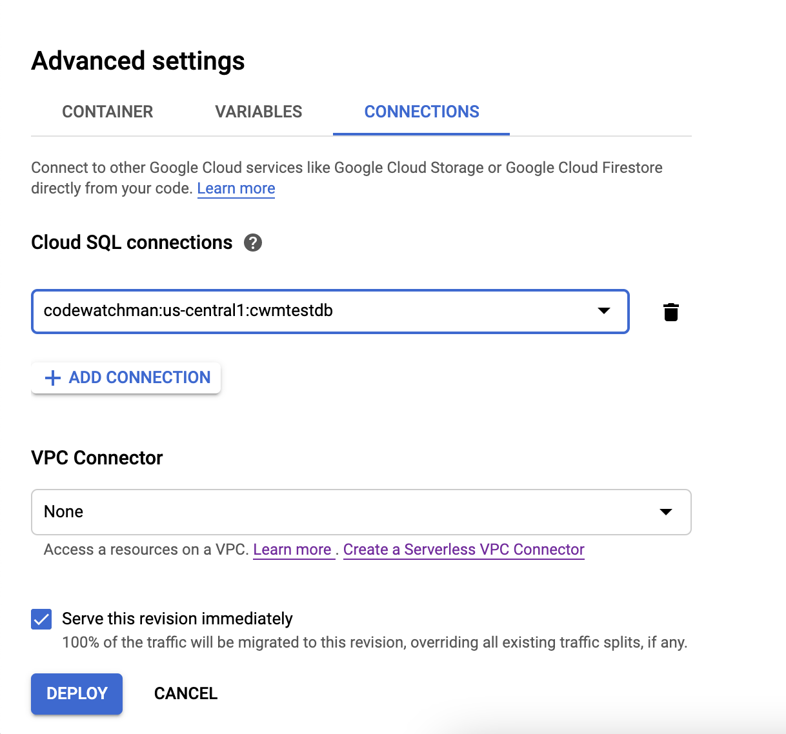
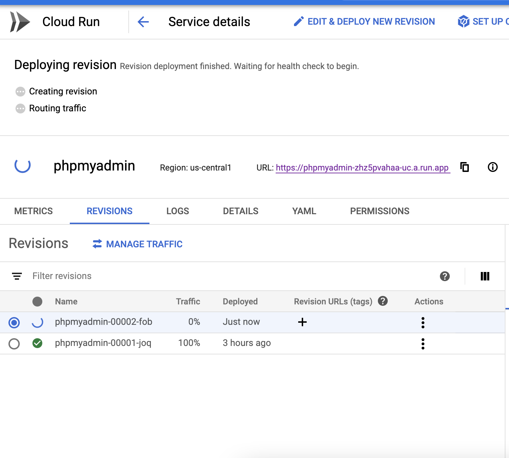

# Running PHPMyAdmin in Google Clour Run

## Purpose

PHPMyAdmin is an important tool when you develop a software with MySQL as database. Many companies use dedicated virtual machines to run it in their cloud. But if we use Google Cloud Run or AWS Fargate for hosting PHPMyAdmin we reduce the cost as we pay only for the amount of resources we use.

This repo and this tutorial will show you how to run PHPMyAdmin in Google Cloud Run and connect it to Cloud SQL.

## Google Cloud Run

Google cloud run is very similar to cloud functions and AWS Lambda functions and Google eqiuivalent to AWS Fargate.

Advantage of using Cloud Run instead of a virtual machine is that you get to use all the power of docker without having to provision and maintain a virtual machine. Also, you only [pay](https://cloud.google.com/run#section-13 "Google Cloud Run pricing") when your code is running. For a startup with less users or a developer like me who barely works on his/her side projects, this is a blessing.

[](https://www.youtube.com/watch?v=gx8VTa1c8DA&ab_channel=GoogleCloudPlatform)

## Copy credentials

I assume that you have a cloud SQL instance already setup.

First we need to generate a random string for blowfish algorithm, which is used in cookie authentication.
Login to your Google Cloud account and open cloud shell. In the shell type




```shell
php -r "echo password_hash(uniqid(), PASSWORD_BCRYPT).PHP_EOL;"
```



The code will generate a random string like `$2y$10$Nwq792qSsaOjAmo/iadx5.TYXV8p87hU8fkT51BwVHw6S.2ZAKqCC`.

Open the `config.inc.php` and paste it as a value for `$cfg['blowfish_secret']`.

```php
$cfg['blowfish_secret'] = '$2y$10$Nwq792qSsaOjAmo/iadx5.TYXV8p87hU8fkT51BwVHw6S.2ZAKqCC';
```

Next, [open cloud sql console](https://console.cloud.google.com/sql/instances) and select the DB. Copy connection name and paste in `host`.



```php
$host = '/cloudsql/<project_name>:<region>:<db_name>';
```

That's it! Setup is now complete.

## Create docker image & upload

This command will build a docker image and save it to Google Container Registry. Next deploy it to Cloud Run.

```shell
gcloud builds submit --tag gcr.io/<PROJECT-ID>/phpmyadmin
```

```shell
gcloud run deploy --image gcr.io/<PROJECT-ID>/phpmyadmin --platform managed
```

Enter a new name or leave the default one.



Choose a region. Preferrably where your cloud SQL is located.



Press "y" and enter. You need unauthenticated access to access the site. Then wait for the process to be completed.



Open [Cloud Run console](https://console.cloud.google.com/run) and click on the newly created phpmyadmin. Click on the URL and you will be redirected to phpmyadmin login page. Use your Cloud SQL username and password for logging in.

Now, you might see a error like below if you try to login now.



If so, click on "Edit & deploy new version". Under "Advacned settings" click connections. Click "add connection" in "Cloud SQL connections" and choose your SQL connection and click deploy.






Wait for deployment to complete and try again.

